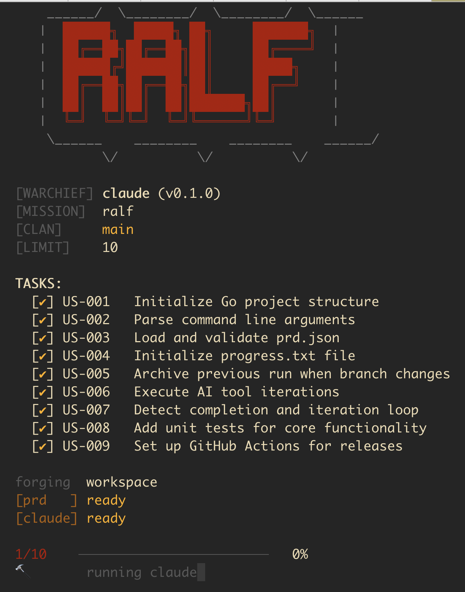

# ralf


Autonomous AI agent loop. Runs Claude or Amp in iterations until task completion.

This is a Go reimplementation of [snarktank/ralph](https://github.com/snarktank/ralph), rewritten in Go for simplicity of setup and portability.



## Installation

### From releases

Download the binary for your platform from [releases](https://github.com/msoedov/ralf/releases).

### From source

```bash
go install github.com/msoedov/ralf/cmd/ralf@latest
```

Or build locally:

```bash
go build -o ralf ./cmd/ralf/
```

## Usage

```bash
ralf [command] [--tool amp|claude] [max_iterations]
```

### Commands

- `run` - Start the AI agent loop (default)
- `init` - Initialize workspace with templates (`prd.json`, `CLAUDE.md`, etc.)

### Options

- `--tool` - AI tool to use: `amp` or `claude` (default: `claude`)
- `--version`, `-v` - Show version
- `--help`, `-h` - Show help

### Arguments

- `max_iterations` - Maximum iterations to run (default: 10)

### Examples

```bash
ralf                    # Run with claude, 10 iterations
ralf init               # Initialize workspace with templates
ralf 20                 # Run with claude, 20 iterations
ralf --tool amp         # Run with amp, 10 iterations
```

## Configuration

`ralf` is completely self-contained. It can initialize a new workspace using its embedded templates.

- `prd.json` - Project configuration with fields:
  - `project` - Project name
  - `branchName` - Git branch name
  - `description` - Feature description
  - `userStories` - List of tasks for the agent
- `CLAUDE.md` - Instructions for Claude (when using `--tool claude`)
- `prompt.md` - Instructions for Amp (when using `--tool amp`)
- `AGENTS.md` - General guidelines for the agents

### prd.json example

```json
{
  "project": "my-project",
  "branchName": "feature/new-feature",
  "description": "Implement the new feature",
  "userStories": [
    {
      "id": "US-001",
      "title": "Add database schema",
      "description": "As a developer...",
      "acceptanceCriteria": ["Table exists", "Typecheck passes"],
      "priority": 1,
      "passes": false,
      "notes": ""
    }
  ]
}
```

## How it works

1. Loads `prd.json` from current directory (auto-initializes if missing or via `ralf init`)
2. Archives previous run if branch changed
3. Initializes `progress.txt` for tracking
4. Runs the AI tool in a loop
5. Checks output for `<promise>COMPLETE</promise>` marker
6. Exits on completion or max iterations

## Compatibility

`ralf` provides full feature parity with the original scripts plus significant enhancements:

| Feature | ralph.sh | ralf |
|---------|----------|------|
| Tool selection (`--tool amp\|claude`) | Yes | Yes |
| Max iterations argument | Yes | Yes |
| PRD loading (`prd.json`) | Yes | Yes |
| User Stories support | Partially | **Full** |
| Branch-based archiving | Yes | Yes |
| Progress file initialization | Yes | Yes |
| Completion detection | Yes | Yes |
| Explicit `init` command | No | **Yes** |
| Self-contained (no external templates) | No | **Yes** |
| ASCII banner & Status UI | No | **Yes** |
| Docker-style progress & Spinner | No | **Yes** |
| Colored output & Time tracking | No | **Yes** |

Default tool changed from `amp` to `claude`.
